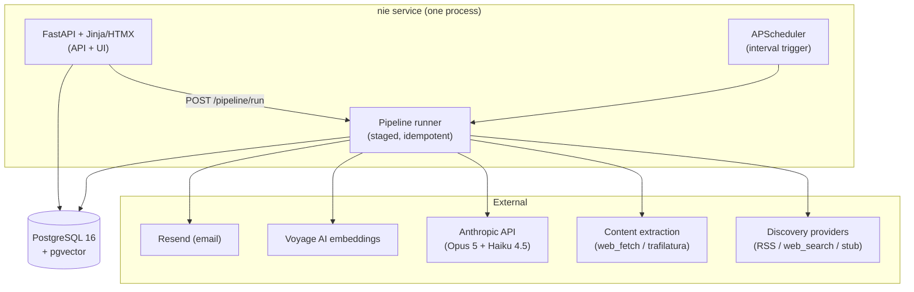

# Technical Design — Event-Driven Intelligence & Notification System

**Companion to:** `plan.md` (product requirements)
**Stack:** Option A — Python monolith + PostgreSQL/pgvector
**Status:** Draft for review. Section 18 lists decisions still open.

---

## 1. Scope

Build the MVP pipeline described in `plan.md`:

> **Discover → Identify Event → Understand → Contextualize → Notify**, for the **Silver** commodity, for a single user.

This document covers architecture, data model, the processing pipeline, the LLM
strategy, the API/UI surface, and the build order. It does **not** commit to a
discovery data source — discovery is a pluggable adapter and the `web_search`
tool adapter is wired in later (see §7).

---

## 2. Architecture

A single deployable Python service (FastAPI process) plus a PostgreSQL database.
The service runs three things in one process:

1. **Web/API** — HTTP endpoints + server-rendered UI.
2. **Scheduler** — APScheduler firing the pipeline on an interval.
3. **Pipeline** — the discover→notify stages, also invokable on demand via an
   endpoint.



Rationale for a monolith: single user, single Watch, iteration speed matters more
than horizontal scale. The pipeline stages are written as independent functions
with explicit state in the database, so lifting them into Celery/Temporal later
is mechanical if the product grows.

---

## 3. Tech stack (locked)

| Concern | Choice | Why |
|---|---|---|
| Language | Python 3.12 | One language for pipeline + web; best LLM/scraping ecosystem |
| Package/deps | `uv` | Fast, reproducible, lockfile |
| Lint/format/type | Ruff, mypy | Standard, fast |
| Test | pytest | Standard |
| Web framework | FastAPI + Uvicorn | Async, Pydantic-native, small |
| UI | Jinja2 + HTMX (+ pico.css) | Server-rendered, no build step, stays in the monolith |
| Data models | SQLAlchemy 2.0 (async) + Alembic | Mature ORM + migrations |
| Database | PostgreSQL 16 + `pgvector` | One datastore for relational + vector |
| Scheduler | APScheduler (`AsyncIOScheduler`) | In-process, no extra infra for MVP |
| Retries | `tenacity` | Per-stage transient-failure handling |
| LLM | `anthropic` SDK — Opus 5 (judgment) + Haiku 4.5 (triage) | See §6 |
| Embeddings | Voyage AI `voyage-3.5` | Anthropic-recommended; avoids a 2nd LLM provider |
| Email | Resend (`resend` SDK) | Good DX, free tier |
| Config | Pydantic Settings + `.env` | Typed config |
| Local/dev/deploy | Docker Compose (`db` + `app`) | One command up |

---

## 4. Data model

All tables carry `watch_id` so the schema is multi-Watch-ready (`plan.md` §16),
even though the MVP seeds exactly one Watch. Timestamps are `timestamptz`.

### `watch` — FR-001, FR-002
| Column | Type | Notes |
|---|---|---|
| id | uuid pk | |
| slug | text unique | `"silver"` |
| name | text | `"Silver Commodity"` |
| status | text | `enabled` \| `disabled` |
| created_at, updated_at | timestamptz | |

### `context_item` — FR-003, FR-004, FR-005
| Column | Type | Notes |
|---|---|---|
| id | uuid pk | |
| watch_id | uuid fk | |
| kind | text | `system` (seeded background) \| `user` (user-provided) |
| label | text | e.g. `"Supply factors"`, or user's own title |
| body | text | free text |
| created_at, updated_at | timestamptz | |

### `source` — FR-007
| Column | Type | Notes |
|---|---|---|
| id | uuid pk | |
| watch_id | uuid fk | |
| url | text | unique per watch; dedup key for discovery |
| title | text | |
| source_name | text | e.g. `"Reuters"` |
| published_at | timestamptz null | |
| discovered_at | timestamptz | |
| content | text null | full extracted text |
| extracted_at | timestamptz null | |
| entities | jsonb | `["Fresnillo", "Mexico", "solar"]` |
| embedding | `vector(1024)` null | over title + content summary |
| status | text | `discovered` \| `extracted` \| `extract_failed` \| `triaged_out` \| `processed` |
| triage_note | text null | why triage dropped it, if it did |

### `event` — FR-010, FR-016, FR-017, FR-019
| Column | Type | Notes |
|---|---|---|
| id | uuid pk | |
| watch_id | uuid fk | |
| title | text | |
| fact_summary | text | **observed information only** |
| interpretation | text | **system interpretation, clearly separated** |
| event_date | timestamptz null | when it happened |
| discovered_at | timestamptz | |
| relevance | text | `irrelevant` \| `low` \| `medium` \| `high` (FR-012) |
| importance | text | `low` \| `medium` \| `high` \| `critical` (FR-014) |
| impact_direction | text | `bullish` \| `bearish` \| `neutral` \| `unclear` (FR-015) |
| impact_reason | text | |
| impact_confidence | text | `low` \| `medium` \| `high` |
| entities | jsonb | |
| embedding | `vector(1024)` | for dedup / relatedness |
| last_material_update_at | timestamptz | bumped only on material change (FR-019) |
| created_at, updated_at | timestamptz | |

### `event_source` — FR-009 (many sources → one event)
`event_id` fk, `source_id` fk, `linked_at`. Unique `(event_id, source_id)`.

### `event_relation` — FR-018
`from_event_id` fk, `to_event_id` fk, `relation` text (`precedes` \| `similar` \| `escalation-of` \| `context-for`), `rationale` text.

### `category` + `event_category` — FR-011
`category`: `id`, `slug`, `name`. Seeded with the 13 categories from `plan.md`
§6; new rows can be added without code changes. `event_category`: `event_id` fk,
`category_id` fk (many-to-many).

### `notification_preference` — FR-023, FR-024
| Column | Type | Notes |
|---|---|---|
| watch_id | uuid fk unique | one row per watch |
| min_importance | text | `medium` default |
| categories | text[] | empty = all categories |
| channels | text[] | `["email", "inapp"]` |

### `notification` — FR-020, FR-021, FR-022
| Column | Type | Notes |
|---|---|---|
| id | uuid pk | |
| watch_id, event_id | uuid fk | |
| reason | text | `new-event` \| `material-update` |
| payload | jsonb | rendered fields: title, what happened, why it matters, category, importance, impact, confidence, historical context, source list |
| channels_sent | text[] | |
| created_at | timestamptz | |
| read_at | timestamptz null | in-app read state |

### `feedback` — FR-025, FR-026
| Column | Type | Notes |
|---|---|---|
| id | uuid pk | |
| watch_id, event_id | uuid fk | |
| verdict | text | `useful` \| `not_useful` \| `too_many_similar` \| `more_like_this` \| `less_of_this` |
| note | text null | |
| created_at | timestamptz | |

### `pipeline_run` — observability
| Column | Type | Notes |
|---|---|---|
| id | uuid pk | |
| trigger | text | `schedule` \| `manual` |
| started_at, finished_at | timestamptz | |
| status | text | `running` \| `ok` \| `partial` \| `failed` |
| stats | jsonb | per-stage counts (discovered, extracted, new_events, updated_events, notified, errors) |
| error | text null | |

---

## 5. Pipeline

One run = these stages in order. Each stage reads/writes explicit row state and
is safe to re-run; a crashed run is recovered by simply running again. `tenacity`
wraps network calls. Every stage writes counters into `pipeline_run.stats`.

| # | Stage | Model | FRs | What it does |
|---|---|---|---|---|
| 1 | **discover** | — | FR-006, FR-007 | Each enabled `DiscoveryProvider` yields candidate items `{url, title, source_name, published_at, snippet, entities?}`. Drop items whose `url` already exists. Insert new `source` rows, `status=discovered`. |
| 2 | **extract** | — | FR-007 | For `discovered` sources without content, fetch full text (provider-supplied, else extraction adapter). Set `content`, `extracted_at`, `status=extracted`. Failure → `status=extract_failed` (retried next run, capped). |
| 3 | **triage** | Haiku 4.5 | FR-012 (cheap pre-filter) | Quick "could this plausibly be a meaningful Silver event?" Drops obvious noise → `status=triaged_out` + `triage_note`. Keeps Opus spend for real candidates. |
| 4 | **embed** | Voyage | FR-008 | Embed `title + content` (summarised if long). Store `source.embedding`. |
| 5 | **match** | — | FR-008, FR-009 | pgvector cosine search over `event.embedding` for events within `DEDUP_WINDOW_DAYS`. Produce a candidate set (may be empty). |
| 6 | **adjudicate** | Opus 5 (structured) | FR-008, FR-009, FR-019 | Given the source + candidate events, decide: `new` \| `existing(event_id)` \| `noise`, plus `materiality: none \| minor \| material`. |
| 7 | **synthesize** | Opus 5 (structured) | FR-010, FR-011, FR-016 | `new` → build the full event record (title, **fact_summary vs interpretation**, event_date, entities, categories). `existing + material` → update the record and bump `last_material_update_at`. Always link `event_source`. |
| 8 | **score** | Opus 5 (structured) | FR-012, FR-013, FR-014, FR-015 | Assign `relevance`, `importance`, `impact_{direction,reason,confidence}`. Prompt is fed the retrieved context bundle (see §6). |
| 9 | **relate** | Opus 5 (structured) | FR-018 | Link to related historical events → `event_relation` rows. |
| 10 | **notify** | — | FR-019, FR-020–FR-024 | Emit a `notification` iff: run produced a `new` event **or** a `material` update; **and** `relevance != irrelevant`; **and** `importance >= pref.min_importance`; **and** (`pref.categories` empty or event shares one). Render `payload`, send on `pref.channels`, record `channels_sent`. |

Stages 6–9 can be merged into fewer Opus calls during tuning; they are listed
separately for clarity. `DEDUP_WINDOW_DAYS`, poll interval, and the importance
threshold are config (§17).

### Idempotency / recovery
- Discovery dedups on `source.url`.
- Each stage filters on row `status` / null columns, so re-running skips
  completed work.
- `event_source` and `event_relation` have unique constraints.
- A partial run leaves rows in intermediate states; the next run finishes them.

---

## 6. LLM strategy

### Model tiering
| Use | Model | Note |
|---|---|---|
| Triage pre-filter (stage 3) | `claude-haiku-4-5` | High volume, low stakes |
| Adjudication, synthesis, scoring, relation (6–9) | `claude-opus-5` | Determines whether notifications are any good |

Escalation to a larger model is a config change; downgrading the judgment tier
should be gated on the eval set (§16).

### Prompt caching
Every stage-6–9 call shares a large stable prefix, so structure each request as:

- **Cached prefix** (one `cache_control` breakpoint): system instructions +
  Silver **system** context items + category taxonomy + the scoring rubric
  (definitions of each relevance/importance/impact level).
- **Volatile suffix** (after the breakpoint): user context items, a short
  rolling summary of recent feedback (FR-026), the candidate source/event, and
  the retrieved historical events.

Verify `usage.cache_read_input_tokens > 0` on the 2nd+ call per run.

### Structured outputs
Use `output_config.format` with an explicit JSON schema for each of:
`AdjudicationResult`, `EventRecord`, `ScoreResult`, `RelationSet`. No prose
parsing. `fact_summary` and `interpretation` are separate required fields in
`EventRecord` — the schema enforces FR-016.

### Context bundle (FR-013)
The retrieval that feeds stage 8:
- all `context_item` rows for the watch (system + user),
- `event_relation`-linked and vector-nearest historical events,
- the source's and candidate event's `entities`,
- a feedback summary: counts of each `verdict` in the last N days, bucketed by
  category (e.g. "user marked 4 `Market` events `too_many_similar`").

### Prompt inventory (files under `src/nie/llm/prompts/`)
`system.md`, `rubric.md`, `triage.md`, `adjudicate.md`, `synthesize.md`,
`score.md`, `relate.md`, `notification_render.md`.

---

## 7. Discovery abstraction (source deferred)

```python
class DiscoveryProvider(Protocol):
    name: str
    def discover(self, watch: Watch, since: datetime) -> Iterable[CandidateItem]: ...
```

`CandidateItem = {url, title, source_name, published_at, snippet, content?, entities?}`

Providers shipped in build order:
1. **`StubProvider`** — reads `tests/fixtures/sources/*.json`. Lets the whole
   pipeline run offline during development and in CI.
2. **`RssProvider`** — a curated feed list (config). Free, deterministic, good
   for the first real end-to-end run.
3. **`WebSearchProvider`** — Anthropic `web_search` tool (`web_search_20260318`,
   dynamic filtering, `response_inclusion: "excluded"`, `max_uses` cap, optional
   `allowed_domains`). **Added at run time**, per decision on 2026-09-10 — the
   pipeline and everything downstream are built and tested against Stub + RSS
   first, then this provider is enabled.

`DISCOVERY_PROVIDERS` (config, CSV) selects which are active. Content extraction
is a sibling adapter (`Extractor` protocol): `WebFetchExtractor` (Anthropic
`web_fetch`) or `TrafilaturaExtractor` (local). A provider that already returns
`content` skips extraction.

---

## 8. Dedup & historical linking

- **Candidate recall:** pgvector cosine `ORDER BY embedding <=> :q LIMIT k`,
  filtered to events with `event_date` (or `discovered_at`) inside
  `DEDUP_WINDOW_DAYS`. Keeps the LLM adjudication input small.
- **Decision:** stage 6 LLM call — `new` / `existing` / `noise` + materiality.
- **Same event, new reporting (FR-019):** `existing` + `materiality != material`
  → link the `source` to the event, do **not** bump
  `last_material_update_at`, do **not** notify.
- **Relatedness (FR-018):** stage 9 proposes `event_relation` rows against
  vector-nearest + entity-overlapping historical events.

---

## 9. Scoring & fact/interpretation split

- `relevance` — `irrelevant` short-circuits: no notification, event still
  stored for history.
- `importance` — potential significance to the Silver market or the user's
  stated interests (user context items are in the prompt).
- `impact` — `{direction, reason, confidence}`; `unclear` is a valid direction.
- `fact_summary` vs `interpretation` — enforced as separate schema fields and
  rendered as separate labelled blocks in the UI and the notification.

---

## 10. Notification

- **Trigger gate:** see stage 10 in §5.
- **Content (FR-021):** `payload` holds event title, "what happened"
  (`fact_summary`), "why it matters" (`interpretation` + importance rationale),
  category, importance, impact + confidence, related historical context (from
  `event_relation`), and the full source list with URLs (FR-022).
- **Channels:** `email` via Resend (Jinja-rendered), `inapp` = `notification`
  rows shown in the UI inbox. `pref.channels` selects.
- **Preferences (FR-023, FR-024):** `min_importance` and `categories` on
  `notification_preference`, editable in the UI.

---

## 11. Feedback loop

- UI shows the 5 verdicts from `plan.md` §13 on every event/notification.
- `POST /events/{id}/feedback` writes a `feedback` row.
- The pipeline's context bundle (§6) includes a rolling feedback summary, so
  future scoring and the notify gate see it (FR-026). MVP keeps this in-prompt;
  no fine-tuning.

---

## 12. HTTP API

| Method + path | Purpose | FRs |
|---|---|---|
| `GET /` | Dashboard: watch status, recent events, unread notifications | — |
| `POST /watch/enable` / `POST /watch/disable` | Toggle monitoring | FR-002 |
| `GET /watch/status` | Current status + last run summary | FR-002 |
| `GET /context` / `POST /context` / `PATCH /context/{id}` / `DELETE /context/{id}` | User context CRUD | FR-004, FR-005 |
| `GET /events` | List/filter by category, importance, relevance, date | FR-027 |
| `GET /events/{id}` | Event detail: fact/interpretation, impact, sources, related events | FR-027 |
| `GET /notifications` | In-app inbox; `POST /notifications/{id}/read` | FR-020 |
| `POST /events/{id}/feedback` | Submit feedback | FR-025 |
| `GET /preferences` / `PATCH /preferences` | Importance threshold + categories | FR-023, FR-024 |
| `POST /pipeline/run` | Trigger a run now | — |
| `GET /pipeline/runs` | Run history + stats | — |

## 13. UI pages (Jinja + HTMX)

- **Dashboard** — status toggle, last run, recent events, unread notifications.
- **Timeline** — filterable event list; each row links to detail.
- **Event detail** — labelled Fact / Interpretation blocks, impact + confidence,
  categories, source links, related events, feedback buttons.
- **Context editor** — list/add/edit/remove user context items; system context
  shown read-only.
- **Preferences** — importance threshold, category multi-select, channels.
- **Inbox** — notifications, mark-read.

---

## 14. Configuration

`.env` (via Pydantic Settings):

| Var | Default | Purpose |
|---|---|---|
| `ANTHROPIC_API_KEY` | — | LLM |
| `DATABASE_URL` | `postgresql+asyncpg://...` | Postgres |
| `VOYAGE_API_KEY` | — | Embeddings |
| `RESEND_API_KEY` | — | Email |
| `NOTIFY_EMAIL_TO` | — | Recipient |
| `DISCOVERY_PROVIDERS` | `stub` | CSV: `stub`, `rss`, `web_search` |
| `RSS_FEEDS` | — | CSV of feed URLs (when `rss` active) |
| `POLL_INTERVAL_MINUTES` | `60` | Scheduler cadence |
| `NOTIFY_MIN_IMPORTANCE` | `medium` | Seed for `notification_preference` |
| `DEDUP_WINDOW_DAYS` | `14` | Candidate recall window |
| `LLM_JUDGMENT_MODEL` | `claude-opus-5` | Stages 6–9 |
| `LLM_TRIAGE_MODEL` | `claude-haiku-4-5` | Stage 3 |
| `WEB_SEARCH_MAX_USES` | `5` | When `web_search` active |

---

## 15. Project layout

```
news-intelligence-engine/
  pyproject.toml            uv.lock
  docker-compose.yml        Dockerfile        .env.example
  alembic.ini               alembic/
  src/nie/
    config.py               db.py             models.py          schemas.py
    web/
      app.py  routers/  templates/  static/
    pipeline/
      runner.py  discover.py  extract.py  triage.py  embed.py
      match.py   adjudicate.py  synthesize.py  score.py  relate.py  notify.py
    llm/
      client.py  caching.py  prompts/
    sources/
      base.py  stub.py  rss.py  web_search.py  extract_webfetch.py  extract_trafilatura.py
    embeddings/   voyage.py
    notifications/ email.py  inbox.py
    seed/         silver_context.md  categories.py  run.py
  tests/
    fixtures/sources/*.json
    test_pipeline_*.py  eval/  (labelled cases for §16)
```

---

## 16. Evals

The plan's success criteria 2–5 and 9–10 are classification-quality targets, so
build a small labelled set early:

- 30–50 fixture articles tagged with: new-event vs same-event (vs which event),
  expected relevance, expected importance.
- A pytest target runs stages 3–8 against fixtures and reports agreement.
- Used to gate any prompt change and any model-tier downgrade.

Optional: Langfuse for request tracing during tuning.

---

## 17. Deployment

`docker-compose.yml`:
- `db` — `pgvector/pgvector:pg16`, volume, healthcheck.
- `app` — the `nie` image; `depends_on: db`; runs Alembic migrations on start,
  then Uvicorn (which also starts the APScheduler job).

`uv run` / `make` tasks: `migrate`, `seed`, `dev`, `run-once` (one pipeline
run), `test`, `eval`.

Seed (`src/nie/seed/run.py`): create the Silver `watch`, load `silver_context.md`
into `context_item` rows (`kind=system`), insert the 13 categories, insert the
default `notification_preference`.

---

## 18. Open decisions (need confirmation)

| # | Decision | Recommendation |
|---|---|---|
| 1 | UI approach | FastAPI + Jinja + HTMX (in-monolith, no build) — vs Streamlit / React |
| 2 | Include the Haiku 4.5 triage pre-filter (stage 3)? | Yes — meaningful Opus-cost saving |
| 3 | Embeddings provider | Voyage AI `voyage-3.5` — vs OpenAI `text-embedding-3-small` / local `bge` |
| 4 | MVP notification channels | Email (Resend) + in-app — add Telegram/Slack? |
| 5 | Auth | None for MVP — single-user, bound to localhost / trusted network |
| 6 | First real discovery source (before `web_search`) | Curated RSS list — need the initial feed set |
| 7 | `web_search` variant when added | `web_search_20260318` + dynamic filtering + `response_inclusion: excluded` + `max_uses` cap |

---

## 19. Build order

| Milestone | Deliverable |
|---|---|
| M0 | Repo skeleton, `uv` deps, Docker Compose, config, `GET /health` |
| M1 | `models.py`, first Alembic migration, seed script (watch + Silver context + categories + prefs) |
| M2 | Pipeline spine: `pipeline_run` tracking, `runner.py`, `POST /pipeline/run`, `StubProvider` — full chain runs offline with no LLM calls (stages stubbed) |
| M3 | LLM stages 6–9 with prompt caching + structured outputs; eval fixtures + `make eval` |
| M4 | pgvector wiring, `embed` + `match` stages, `triage` stage |
| M5 | Notifications: Resend + in-app inbox, trigger gate, preferences |
| M6 | UI: dashboard, timeline, event detail, context editor, preferences, inbox |
| M7 | Feedback capture + rolling feedback summary into the context bundle |
| M8 | `RssProvider` + extraction adapter; first real end-to-end run |
| M9 | `WebSearchProvider` enabled; APScheduler polling on `POLL_INTERVAL_MINUTES` |

---

## 20. Out of scope (from `plan.md` §15)

Price prediction, buy/sell recommendations, automated trading, portfolio
management, technical strategies, a complex dashboard, multiple Watch types,
non-Silver monitoring, autonomous long-form research.

**Extensibility kept in:** every table is keyed by `watch_id`; the pipeline
takes a `Watch`; discovery/context/scoring are watch-scoped. Adding a second
Watch later is data + config, not a redesign.
